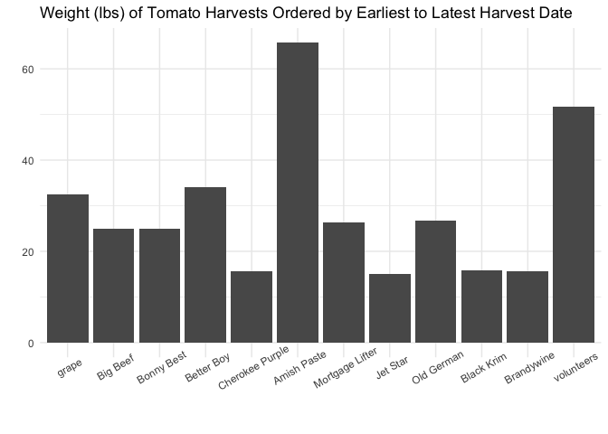

```r
library(tidyverse)     # for graphing and data cleaning
```

```
## ── Attaching packages ─────────────────────────────────────── tidyverse 1.3.0 ──
```

```
## ✓ ggplot2 3.3.3     ✓ purrr   0.3.4
## ✓ tibble  3.0.5     ✓ dplyr   1.0.3
## ✓ tidyr   1.1.2     ✓ stringr 1.4.0
## ✓ readr   1.4.0     ✓ forcats 0.5.0
```

```
## ── Conflicts ────────────────────────────────────────── tidyverse_conflicts() ──
## x dplyr::filter() masks stats::filter()
## x dplyr::lag()    masks stats::lag()
```

```r
library(gardenR)       # for Lisa's garden data
library(lubridate)     # for date manipulation
```

```
## 
## Attaching package: 'lubridate'
```

```
## The following objects are masked from 'package:base':
## 
##     date, intersect, setdiff, union
```

```r
library(ggthemes)      # for even more plotting themes
library(geofacet)      # for special faceting with US map layout
theme_set(theme_minimal())       # My favorite ggplot() theme :)
```


```r
# Lisa's garden data
data("garden_harvest")

# Seeds/plants (and other garden supply) costs
data("garden_spending")

# Planting dates and locations
data("garden_planting")

# Tidy Tuesday data
kids <- readr::read_csv('https://raw.githubusercontent.com/rfordatascience/tidytuesday/master/data/2020/2020-09-15/kids.csv')
```

```
## 
## ── Column specification ────────────────────────────────────────────────────────
## cols(
##   state = col_character(),
##   variable = col_character(),
##   year = col_double(),
##   raw = col_double(),
##   inf_adj = col_double(),
##   inf_adj_perchild = col_double()
## )
```

## Setting up on GitHub!

Before starting your assignment, you need to get yourself set up on GitHub and make sure GitHub is connected to R Studio. To do that, you should read the instruction (through the "Cloning a repo" section) and watch the video [here](https://github.com/llendway/github_for_collaboration/blob/master/github_for_collaboration.md). Then, do the following (if you get stuck on a step, don't worry, I will help! You can always get started on the homework and we can figure out the GitHub piece later):

* Create a repository on GitHub, giving it a nice name so you know it is for the 3rd weekly exercise assignment (follow the instructions in the document/video).  
* Copy the repo name so you can clone it to your computer. In R Studio, go to file --> New project --> Version control --> Git and follow the instructions from the document/video.  
* Download the code from this document and save it in the repository folder/project on your computer.  
* In R Studio, you should then see the .Rmd file in the upper right corner in the Git tab (along with the .Rproj file and probably .gitignore).  
* Check all the boxes of the files in the Git tab and choose commit.  
* In the commit window, write a commit message, something like "Initial upload" would be appropriate, and commit the files.  
* Either click the green up arrow in the commit window or close the commit window and click the green up arrow in the Git tab to push your changes to GitHub.  
* Refresh your GitHub page (online) and make sure the new documents have been pushed out.  
* Back in R Studio, knit the .Rmd file. When you do that, you should have two (as long as you didn't make any changes to the .Rmd file, in which case you might have three) files show up in the Git tab - an .html file and an .md file. The .md file is something we haven't seen before and is here because I included `keep_md: TRUE` in the YAML heading. The .md file is a markdown (NOT R Markdown) file that is an interim step to creating the html file. They are displayed fairly nicely in GitHub, so we want to keep it and look at it there. Click the boxes next to these two files, commit changes (remember to include a commit message), and push them (green up arrow).  
* As you work through your homework, save and commit often, push changes occasionally (maybe after you feel finished with an exercise?), and go check to see what the .md file looks like on GitHub.  
* If you have issues, let me know! This is new to many of you and may not be intuitive at first. But, I promise, you'll get the hang of it! 


## Instructions

* Put your name at the top of the document. 

* **For ALL graphs, you should include appropriate labels.** 

* Feel free to change the default theme, which I currently have set to `theme_minimal()`. 

* Use good coding practice. Read the short sections on good code with [pipes](https://style.tidyverse.org/pipes.html) and [ggplot2](https://style.tidyverse.org/ggplot2.html). **This is part of your grade!**

* When you are finished with ALL the exercises, uncomment the options at the top so your document looks nicer. Don't do it before then, or else you might miss some important warnings and messages.


## Warm-up exercises with garden data

These exercises will reiterate what you learned in the "Expanding the data wrangling toolkit" tutorial. If you haven't gone through the tutorial yet, you should do that first.

  1. Summarize the `garden_harvest` data to find the total harvest weight in pounds for each vegetable and day of week (HINT: use the `wday()` function from `lubridate`). Display the results so that the vegetables are rows but the days of the week are columns.


```r
garden_harvest %>% 
  mutate(wk_day = wday(date, label = TRUE)) %>% 
  group_by(vegetable, wk_day) %>% 
  summarise(total_weight = sum(weight)) %>% 
  pivot_wider(id_cols = vegetable,
              names_from = wk_day,
              values_from = total_weight)
```

```
## `summarise()` has grouped output by 'vegetable'. You can override using the `.groups` argument.
```

<div data-pagedtable="false">
  <script data-pagedtable-source type="application/json">
{"columns":[{"label":["vegetable"],"name":[1],"type":["chr"],"align":["left"]},{"label":["Sat"],"name":[2],"type":["dbl"],"align":["right"]},{"label":["Mon"],"name":[3],"type":["dbl"],"align":["right"]},{"label":["Tue"],"name":[4],"type":["dbl"],"align":["right"]},{"label":["Thu"],"name":[5],"type":["dbl"],"align":["right"]},{"label":["Fri"],"name":[6],"type":["dbl"],"align":["right"]},{"label":["Sun"],"name":[7],"type":["dbl"],"align":["right"]},{"label":["Wed"],"name":[8],"type":["dbl"],"align":["right"]}],"data":[{"1":"apple","2":"156","3":"NA","4":"NA","5":"NA","6":"NA","7":"NA","8":"NA"},{"1":"asparagus","2":"20","3":"NA","4":"NA","5":"NA","6":"NA","7":"NA","8":"NA"},{"1":"basil","2":"186","3":"30","4":"50","5":"12","6":"212","7":"NA","8":"NA"},{"1":"beans","2":"2136","3":"2952","4":"1990","5":"1539","6":"692","7":"868","8":"1852"},{"1":"beets","2":"172","3":"305","4":"72","5":"5394","6":"11","7":"146","8":"83"},{"1":"broccoli","2":"NA","3":"372","4":"NA","5":"NA","6":"75","7":"571","8":"321"},{"1":"carrots","2":"1057","3":"395","4":"160","5":"1213","6":"970","7":"1332","8":"2523"},{"1":"chives","2":"NA","3":"NA","4":"NA","5":"NA","6":"NA","7":"NA","8":"8"},{"1":"cilantro","2":"17","3":"NA","4":"2","5":"NA","6":"33","7":"NA","8":"NA"},{"1":"corn","2":"597","3":"344","4":"330","5":"NA","6":"1564","7":"661","8":"2405"},{"1":"cucumbers","2":"4373","3":"2166","4":"4557","5":"1500","6":"3370","7":"1408","8":"2407"},{"1":"edamame","2":"2127","3":"NA","4":"636","5":"NA","6":"NA","7":"NA","8":"NA"},{"1":"hot peppers","2":"NA","3":"571","4":"64","5":"NA","6":"NA","7":"NA","8":"31"},{"1":"jalapeño","2":"684","3":"2519","4":"249","5":"102","6":"587","7":"119","8":"218"},{"1":"kale","2":"676","3":"938","4":"128","5":"127","6":"173","7":"375","8":"280"},{"1":"kohlrabi","2":"NA","3":"NA","4":"NA","5":"191","6":"NA","7":"NA","8":"NA"},{"1":"lettuce","2":"597","3":"1115","4":"416","5":"1112","6":"817","7":"665","8":"538"},{"1":"onions","2":"868","3":"231","4":"321","5":"273","6":"33","7":"118","8":"NA"},{"1":"peas","2":"1294","3":"2102","4":"938","5":"1541","6":"425","7":"933","8":"490"},{"1":"peppers","2":"627","3":"1146","4":"655","5":"322","6":"152","7":"228","8":"1108"},{"1":"potatoes","2":"1271","3":"440","4":"NA","5":"5376","6":"1697","7":"NA","8":"2073"},{"1":"pumpkins","2":"42043","3":"13662","4":"14450","5":"NA","6":"NA","7":"NA","8":"NA"},{"1":"radish","2":"105","3":"89","4":"43","5":"67","6":"88","7":"37","8":"NA"},{"1":"raspberries","2":"242","3":"59","4":"152","5":"131","6":"259","7":"NA","8":"NA"},{"1":"rutabaga","2":"3129","3":"NA","4":"NA","5":"NA","6":"1623","7":"8738","8":"NA"},{"1":"spinach","2":"118","3":"67","4":"225","5":"106","6":"89","7":"221","8":"97"},{"1":"squash","2":"25502","3":"11038","4":"8377","5":"NA","6":"NA","7":"NA","8":"NA"},{"1":"strawberries","2":"77","3":"217","4":"NA","5":"40","6":"221","7":"37","8":"NA"},{"1":"Swiss chard","2":"333","3":"487","4":"32","5":"1012","6":"280","7":"566","8":"412"},{"1":"tomatoes","2":"15933","3":"5213","4":"22113","5":"15657","6":"38590","7":"34296","8":"26429"},{"1":"zucchini","2":"1549","3":"5532","4":"7470","5":"15708","6":"8492","7":"5550","8":"926"}],"options":{"columns":{"min":{},"max":[10]},"rows":{"min":[10],"max":[10]},"pages":{}}}
  </script>
</div>

  2. Summarize the `garden_harvest` data to find the total harvest in pound for each vegetable variety and then try adding the plot from the `garden_planting` table. This will not turn out perfectly. What is the problem? How might you fix it?
  
  The problem is that we summarize the data so there is only one entry for each variety but we are trying to combine it with a dataset that has multiple entries for each variety. The final product has repeat entries for variety where the total harvest weight for the variety is the same, but the plot is different. We could modify this by summarizing the `garden_planting` data to only include the first plot for each variety and then combining the two datasets.


```r
garden_harvest %>% 
  group_by(variety) %>% 
  summarize(variety_weight_lbs = sum(weight) * 0.00220462) %>% 
  left_join(garden_planting,
            by = c("variety"))
```

<div data-pagedtable="false">
  <script data-pagedtable-source type="application/json">
{"columns":[{"label":["variety"],"name":[1],"type":["chr"],"align":["left"]},{"label":["variety_weight_lbs"],"name":[2],"type":["dbl"],"align":["right"]},{"label":["plot"],"name":[3],"type":["chr"],"align":["left"]},{"label":["vegetable"],"name":[4],"type":["chr"],"align":["left"]},{"label":["number_seeds_planted"],"name":[5],"type":["dbl"],"align":["right"]},{"label":["date"],"name":[6],"type":["date"],"align":["right"]},{"label":["number_seeds_exact"],"name":[7],"type":["lgl"],"align":["right"]},{"label":["notes"],"name":[8],"type":["chr"],"align":["left"]}],"data":[{"1":"Amish Paste","2":"65.67342518","3":"J","4":"tomatoes","5":"1","6":"2020-05-20","7":"TRUE","8":"NA"},{"1":"Amish Paste","2":"65.67342518","3":"N","4":"tomatoes","5":"2","6":"2020-05-20","7":"TRUE","8":"NA"},{"1":"asparagus","2":"0.04409240","3":"NA","4":"NA","5":"NA","6":"<NA>","7":"NA","8":"NA"},{"1":"Better Boy","2":"34.00846812","3":"J","4":"tomatoes","5":"1","6":"2020-05-20","7":"TRUE","8":"NA"},{"1":"Better Boy","2":"34.00846812","3":"N","4":"tomatoes","5":"1","6":"2020-05-20","7":"TRUE","8":"NA"},{"1":"Big Beef","2":"24.99377694","3":"N","4":"tomatoes","5":"1","6":"2020-05-20","7":"TRUE","8":"NA"},{"1":"Black Krim","2":"15.80712540","3":"N","4":"tomatoes","5":"1","6":"2020-05-20","7":"TRUE","8":"NA"},{"1":"Blue (saved)","2":"41.52401770","3":"A","4":"squash","5":"4","6":"2020-05-20","7":"TRUE","8":"NA"},{"1":"Blue (saved)","2":"41.52401770","3":"B","4":"squash","5":"8","6":"2020-05-20","7":"TRUE","8":"NA"},{"1":"Bolero","2":"8.29157582","3":"H","4":"carrots","5":"50","6":"2020-05-02","7":"FALSE","8":"NA"},{"1":"Bolero","2":"8.29157582","3":"L","4":"carrots","5":"50","6":"2020-05-25","7":"FALSE","8":"NA"},{"1":"Bonny Best","2":"24.92322910","3":"J","4":"tomatoes","5":"1","6":"2020-05-20","7":"TRUE","8":"NA"},{"1":"Brandywine","2":"15.64618814","3":"J","4":"tomatoes","5":"1","6":"2020-05-20","7":"TRUE","8":"NA"},{"1":"Bush Bush Slender","2":"22.12997556","3":"M","4":"beans","5":"30","6":"2020-05-16","7":"FALSE","8":"NA"},{"1":"Bush Bush Slender","2":"22.12997556","3":"D","4":"beans","5":"10","6":"2020-05-21","7":"TRUE","8":"NA"},{"1":"Catalina","2":"2.03486426","3":"H","4":"spinach","5":"50","6":"2020-05-16","7":"FALSE","8":"NA"},{"1":"Catalina","2":"2.03486426","3":"E","4":"spinach","5":"100","6":"2020-06-20","7":"FALSE","8":"NA"},{"1":"Cherokee Purple","2":"15.71232674","3":"J","4":"tomatoes","5":"1","6":"2020-05-20","7":"TRUE","8":"NA"},{"1":"Chinese Red Noodle","2":"0.78484472","3":"K","4":"beans","5":"5","6":"2020-05-25","7":"TRUE","8":"NA"},{"1":"Chinese Red Noodle","2":"0.78484472","3":"L","4":"beans","5":"5","6":"2020-05-25","7":"TRUE","8":"NA"},{"1":"cilantro","2":"0.11464024","3":"potD","4":"cilantro","5":"15","6":"2020-05-16","7":"FALSE","8":"NA"},{"1":"cilantro","2":"0.11464024","3":"E","4":"cilantro","5":"20","6":"2020-06-20","7":"FALSE","8":"NA"},{"1":"Cinderella's Carraige","2":"32.87308882","3":"B","4":"pumpkins","5":"3","6":"2020-05-20","7":"TRUE","8":"NA"},{"1":"Classic Slenderette","2":"3.60455370","3":"E","4":"beans","5":"29","6":"2020-06-20","7":"TRUE","8":"NA"},{"1":"Crispy Colors Duo","2":"0.42108242","3":"front","4":"kohlrabi","5":"10","6":"2020-05-20","7":"FALSE","8":"NA"},{"1":"delicata","2":"10.49840044","3":"K","4":"squash","5":"8","6":"2020-05-25","7":"TRUE","8":"NA"},{"1":"Delicious Duo","2":"0.75398004","3":"P","4":"onions","5":"25","6":"2020-04-26","7":"FALSE","8":"NA"},{"1":"Dorinny Sweet","2":"11.40670388","3":"A","4":"corn","5":"20","6":"2020-05-25","7":"FALSE","8":"NA"},{"1":"Dragon","2":"4.10500244","3":"H","4":"carrots","5":"40","6":"2020-05-02","7":"FALSE","8":"NA"},{"1":"Dragon","2":"4.10500244","3":"L","4":"carrots","5":"50","6":"2020-05-25","7":"FALSE","8":"NA"},{"1":"edamame","2":"6.09136506","3":"O","4":"edamame","5":"25","6":"2020-05-16","7":"FALSE","8":"NA"},{"1":"Farmer's Market Blend","2":"3.80296950","3":"C","4":"lettuce","5":"60","6":"2020-05-02","7":"FALSE","8":"NA"},{"1":"Farmer's Market Blend","2":"3.80296950","3":"L","4":"lettuce","5":"60","6":"2020-05-16","7":"FALSE","8":"NA"},{"1":"Garden Party Mix","2":"0.94578198","3":"C","4":"radish","5":"20","6":"2020-05-02","7":"FALSE","8":"NA"},{"1":"Garden Party Mix","2":"0.94578198","3":"G","4":"radish","5":"30","6":"2020-05-02","7":"FALSE","8":"NA"},{"1":"Garden Party Mix","2":"0.94578198","3":"H","4":"radish","5":"15","6":"2020-05-02","7":"FALSE","8":"NA"},{"1":"giant","2":"9.87228836","3":"L","4":"jalapeño","5":"4","6":"2020-05-21","7":"TRUE","8":"NA"},{"1":"Golden Bantam","2":"1.60275874","3":"B","4":"corn","5":"20","6":"2020-05-25","7":"FALSE","8":"NA"},{"1":"Gourmet Golden","2":"7.02171470","3":"H","4":"beets","5":"40","6":"2020-05-02","7":"FALSE","8":"NA"},{"1":"grape","2":"32.39468628","3":"O","4":"tomatoes","5":"1","6":"2020-05-20","7":"TRUE","8":"NA"},{"1":"green","2":"5.69232884","3":"K","4":"peppers","5":"12","6":"2020-05-21","7":"TRUE","8":"NA"},{"1":"green","2":"5.69232884","3":"O","4":"peppers","5":"5","6":"2020-05-21","7":"TRUE","8":"NA"},{"1":"greens","2":"0.37258078","3":"NA","4":"NA","5":"NA","6":"<NA>","7":"NA","8":"NA"},{"1":"Heirloom Lacinto","2":"5.94586014","3":"P","4":"kale","5":"30","6":"2020-05-02","7":"FALSE","8":"NA"},{"1":"Heirloom Lacinto","2":"5.94586014","3":"front","4":"kale","5":"30","6":"2020-06-20","7":"FALSE","8":"NA"},{"1":"Improved Helenor","2":"29.74032380","3":"E","4":"rudabaga","5":"30","6":"2020-05-25","7":"FALSE","8":"NA"},{"1":"Isle of Naxos","2":"1.08026380","3":"potB","4":"basil","5":"40","6":"2020-05-16","7":"FALSE","8":"NA"},{"1":"Jet Star","2":"15.02448530","3":"N","4":"tomatoes","5":"1","6":"2020-05-20","7":"TRUE","8":"NA"},{"1":"King Midas","2":"4.09618396","3":"H","4":"carrots","5":"50","6":"2020-05-02","7":"FALSE","8":"NA"},{"1":"King Midas","2":"4.09618396","3":"L","4":"carrots","5":"50","6":"2020-05-25","7":"FALSE","8":"NA"},{"1":"leaves","2":"0.22266662","3":"NA","4":"NA","5":"NA","6":"<NA>","7":"NA","8":"NA"},{"1":"Lettuce Mixture","2":"4.74875148","3":"G","4":"lettuce","5":"200","6":"2020-06-20","7":"FALSE","8":"NA"},{"1":"Long Keeping Rainbow","2":"3.31133924","3":"H","4":"onions","5":"40","6":"2020-04-26","7":"FALSE","8":"NA"},{"1":"Magnolia Blossom","2":"7.45822946","3":"B","4":"peas","5":"24","6":"2020-04-19","7":"TRUE","8":"NA"},{"1":"Main Crop Bravado","2":"2.13186754","3":"D","4":"broccoli","5":"7","6":"2020-05-22","7":"TRUE","8":"NA"},{"1":"Main Crop Bravado","2":"2.13186754","3":"I","4":"broccoli","5":"7","6":"2020-05-22","7":"TRUE","8":"NA"},{"1":"Mortgage Lifter","2":"26.32536742","3":"J","4":"tomatoes","5":"1","6":"2020-05-20","7":"TRUE","8":"died"},{"1":"Mortgage Lifter","2":"26.32536742","3":"N","4":"tomatoes","5":"1","6":"2020-05-20","7":"TRUE","8":"NA"},{"1":"mustard greens","2":"0.05070626","3":"NA","4":"NA","5":"NA","6":"<NA>","7":"NA","8":"NA"},{"1":"Neon Glow","2":"6.88282364","3":"M","4":"Swiss chard","5":"25","6":"2020-05-02","7":"FALSE","8":"NA"},{"1":"New England Sugar","2":"44.85960776","3":"K","4":"pumpkins","5":"4","6":"2020-05-25","7":"TRUE","8":"NA"},{"1":"Old German","2":"26.71778978","3":"J","4":"tomatoes","5":"1","6":"2020-05-20","7":"TRUE","8":"NA"},{"1":"perrenial","2":"3.18126666","3":"NA","4":"NA","5":"NA","6":"<NA>","7":"NA","8":"NA"},{"1":"pickling","2":"43.60958822","3":"L","4":"cucumbers","5":"20","6":"2020-05-25","7":"FALSE","8":"NA"},{"1":"purple","2":"3.00930630","3":"D","4":"potatoes","5":"5","6":"2020-05-02","7":"FALSE","8":"NA"},{"1":"red","2":"4.43349082","3":"I","4":"potatoes","5":"3","6":"2020-05-22","7":"FALSE","8":"NA"},{"1":"Red Kuri","2":"22.73183682","3":"A","4":"squash","5":"4","6":"2020-05-20","7":"TRUE","8":"NA"},{"1":"Red Kuri","2":"22.73183682","3":"B","4":"squash","5":"4","6":"2020-05-20","7":"TRUE","8":"NA"},{"1":"Red Kuri","2":"22.73183682","3":"side","4":"squash","5":"1","6":"2020-05-20","7":"TRUE","8":"NA"},{"1":"reseed","2":"0.09920790","3":"NA","4":"NA","5":"NA","6":"<NA>","7":"NA","8":"NA"},{"1":"Romanesco","2":"99.70834874","3":"D","4":"zucchini","5":"3","6":"2020-05-21","7":"TRUE","8":"NA"},{"1":"Russet","2":"9.09185288","3":"D","4":"potatoes","5":"8","6":"2020-05-02","7":"FALSE","8":"NA"},{"1":"saved","2":"76.93241952","3":"B","4":"pumpkins","5":"8","6":"2020-05-20","7":"TRUE","8":"NA"},{"1":"Super Sugar Snap","2":"9.56805080","3":"A","4":"peas","5":"22","6":"2020-04-19","7":"TRUE","8":"NA"},{"1":"Sweet Merlin","2":"6.38678414","3":"H","4":"beets","5":"40","6":"2020-05-02","7":"FALSE","8":"NA"},{"1":"Tatsoi","2":"2.89466606","3":"P","4":"lettuce","5":"25","6":"2020-05-02","7":"FALSE","8":"NA"},{"1":"thai","2":"0.14770954","3":"potB","4":"hot peppers","5":"1","6":"2020-05-21","7":"TRUE","8":"NA"},{"1":"unknown","2":"0.34392072","3":"NA","4":"NA","5":"NA","6":"<NA>","7":"NA","8":"NA"},{"1":"variety","2":"4.97141810","3":"potA","4":"peppers","5":"3","6":"2020-05-21","7":"TRUE","8":"NA"},{"1":"variety","2":"4.97141810","3":"potA","4":"peppers","5":"3","6":"2020-05-21","7":"TRUE","8":"NA"},{"1":"variety","2":"4.97141810","3":"potC","4":"hot peppers","5":"6","6":"2020-05-21","7":"TRUE","8":"NA"},{"1":"variety","2":"4.97141810","3":"potD","4":"peppers","5":"1","6":"2020-05-21","7":"TRUE","8":"NA"},{"1":"volunteers","2":"51.61235882","3":"N","4":"tomatoes","5":"1","6":"2020-06-03","7":"TRUE","8":"NA"},{"1":"volunteers","2":"51.61235882","3":"J","4":"tomatoes","5":"1","6":"2020-06-03","7":"TRUE","8":"NA"},{"1":"volunteers","2":"51.61235882","3":"front","4":"tomatoes","5":"5","6":"2020-06-03","7":"TRUE","8":"NA"},{"1":"volunteers","2":"51.61235882","3":"O","4":"tomatoes","5":"2","6":"2020-06-03","7":"TRUE","8":"NA"},{"1":"Waltham Butternut","2":"24.27066158","3":"A","4":"squash","5":"4","6":"2020-05-20","7":"TRUE","8":"NA"},{"1":"Waltham Butternut","2":"24.27066158","3":"K","4":"squash","5":"6","6":"2020-05-25","7":"TRUE","8":"NA"},{"1":"yellow","2":"7.40090934","3":"I","4":"potatoes","5":"10","6":"2020-05-02","7":"FALSE","8":"NA"},{"1":"yellow","2":"7.40090934","3":"I","4":"potatoes","5":"8","6":"2020-05-22","7":"TRUE","8":"NA"},{"1":"Yod Fah","2":"0.82011864","3":"P","4":"broccoli","5":"25","6":"2020-05-16","7":"FALSE","8":"NA"}],"options":{"columns":{"min":{},"max":[10]},"rows":{"min":[10],"max":[10]},"pages":{}}}
  </script>
</div>

  3. I would like to understand how much money I "saved" by gardening, for each vegetable type. Describe how I could use the `garden_harvest` and `garden_spending` datasets, along with data from somewhere like [this](https://products.wholefoodsmarket.com/search?sort=relevance&store=10542) to answer this question. You can answer this in words, referencing various join functions. You don't need R code but could provide some if it's helpful.

  4. Subset the data to tomatoes. Reorder the tomato varieties from smallest to largest first harvest date. Create a barplot of total harvest in pounds for each variety, in the new order.


```r
garden_harvest %>% 
  filter(vegetable == "tomatoes") %>% 
  mutate(variety2 = fct_reorder(variety, date, min, .desc =FALSE)) %>% 
  group_by(variety2) %>% 
  summarise(variety_weight_lbs = sum(weight) * 0.00220462,
            mindate=min(date)) %>%  #I have this here just to make sure my reorder fn is working properly
  ggplot() +
  geom_col(aes(y = variety_weight_lbs, x = variety2)) +
  labs(title = "Weight (lbs) of Tomato Harvests Ordered by Earliest to Latest Harvest Date",
       x = "",
       y= "") +
  theme(axis.text.x = element_text(angle = 30))
```

<!-- -->

  5. In the `garden_harvest` data, create two new variables: one that makes the varieties lowercase and another that finds the length of the variety name. Arrange the data by vegetable and length of variety name (smallest to largest), with one row for each vegetable variety. HINT: use `str_to_lower()`, `str_length()`, and `distinct()`.
  

```r
garden_harvest %>% 
  mutate(str_variety= str_to_lower(variety),
         len_variety = str_length(variety)) %>% 
  distinct(str_variety, .keep_all = TRUE) %>% 
  arrange(vegetable, len_variety)
```

<div data-pagedtable="false">
  <script data-pagedtable-source type="application/json">
{"columns":[{"label":["vegetable"],"name":[1],"type":["chr"],"align":["left"]},{"label":["variety"],"name":[2],"type":["chr"],"align":["left"]},{"label":["date"],"name":[3],"type":["date"],"align":["right"]},{"label":["weight"],"name":[4],"type":["dbl"],"align":["right"]},{"label":["units"],"name":[5],"type":["chr"],"align":["left"]},{"label":["str_variety"],"name":[6],"type":["chr"],"align":["left"]},{"label":["len_variety"],"name":[7],"type":["int"],"align":["right"]}],"data":[{"1":"apple","2":"unknown","3":"2020-09-26","4":"156","5":"grams","6":"unknown","7":"7"},{"1":"asparagus","2":"asparagus","3":"2020-06-20","4":"20","5":"grams","6":"asparagus","7":"9"},{"1":"basil","2":"Isle of Naxos","3":"2020-06-23","4":"5","5":"grams","6":"isle of naxos","7":"13"},{"1":"beans","2":"Bush Bush Slender","3":"2020-07-06","4":"235","5":"grams","6":"bush bush slender","7":"17"},{"1":"beans","2":"Chinese Red Noodle","3":"2020-08-08","4":"108","5":"grams","6":"chinese red noodle","7":"18"},{"1":"beans","2":"Classic Slenderette","3":"2020-08-05","4":"41","5":"grams","6":"classic slenderette","7":"19"},{"1":"beets","2":"leaves","3":"2020-06-11","4":"8","5":"grams","6":"leaves","7":"6"},{"1":"beets","2":"Sweet Merlin","3":"2020-07-07","4":"10","5":"grams","6":"sweet merlin","7":"12"},{"1":"beets","2":"Gourmet Golden","3":"2020-07-07","4":"62","5":"grams","6":"gourmet golden","7":"14"},{"1":"broccoli","2":"Yod Fah","3":"2020-07-27","4":"372","5":"grams","6":"yod fah","7":"7"},{"1":"broccoli","2":"Main Crop Bravado","3":"2020-09-09","4":"102","5":"grams","6":"main crop bravado","7":"17"},{"1":"carrots","2":"Dragon","3":"2020-07-24","4":"80","5":"grams","6":"dragon","7":"6"},{"1":"carrots","2":"Bolero","3":"2020-07-30","4":"116","5":"grams","6":"bolero","7":"6"},{"1":"carrots","2":"greens","3":"2020-08-29","4":"169","5":"grams","6":"greens","7":"6"},{"1":"carrots","2":"King Midas","3":"2020-07-23","4":"56","5":"grams","6":"king midas","7":"10"},{"1":"chives","2":"perrenial","3":"2020-06-17","4":"8","5":"grams","6":"perrenial","7":"9"},{"1":"cilantro","2":"cilantro","3":"2020-06-23","4":"2","5":"grams","6":"cilantro","7":"8"},{"1":"corn","2":"Dorinny Sweet","3":"2020-08-11","4":"330","5":"grams","6":"dorinny sweet","7":"13"},{"1":"corn","2":"Golden Bantam","3":"2020-08-15","4":"383","5":"grams","6":"golden bantam","7":"13"},{"1":"cucumbers","2":"pickling","3":"2020-07-08","4":"181","5":"grams","6":"pickling","7":"8"},{"1":"edamame","2":"edamame","3":"2020-08-11","4":"109","5":"grams","6":"edamame","7":"7"},{"1":"hot peppers","2":"thai","3":"2020-07-20","4":"12","5":"grams","6":"thai","7":"4"},{"1":"hot peppers","2":"variety","3":"2020-07-20","4":"559","5":"grams","6":"variety","7":"7"},{"1":"jalapeño","2":"giant","3":"2020-07-17","4":"20","5":"grams","6":"giant","7":"5"},{"1":"kale","2":"Heirloom Lacinto","3":"2020-06-13","4":"10","5":"grams","6":"heirloom lacinto","7":"16"},{"1":"kohlrabi","2":"Crispy Colors Duo","3":"2020-09-17","4":"191","5":"grams","6":"crispy colors duo","7":"17"},{"1":"lettuce","2":"reseed","3":"2020-06-06","4":"20","5":"grams","6":"reseed","7":"6"},{"1":"lettuce","2":"Tatsoi","3":"2020-06-20","4":"18","5":"grams","6":"tatsoi","7":"6"},{"1":"lettuce","2":"mustard greens","3":"2020-06-29","4":"23","5":"grams","6":"mustard greens","7":"14"},{"1":"lettuce","2":"Lettuce Mixture","3":"2020-07-22","4":"23","5":"grams","6":"lettuce mixture","7":"15"},{"1":"lettuce","2":"Farmer's Market Blend","3":"2020-06-11","4":"12","5":"grams","6":"farmer's market blend","7":"21"},{"1":"onions","2":"Delicious Duo","3":"2020-07-16","4":"50","5":"grams","6":"delicious duo","7":"13"},{"1":"onions","2":"Long Keeping Rainbow","3":"2020-07-20","4":"102","5":"grams","6":"long keeping rainbow","7":"20"},{"1":"peas","2":"Magnolia Blossom","3":"2020-06-17","4":"8","5":"grams","6":"magnolia blossom","7":"16"},{"1":"peas","2":"Super Sugar Snap","3":"2020-06-17","4":"121","5":"grams","6":"super sugar snap","7":"16"},{"1":"peppers","2":"green","3":"2020-08-04","4":"81","5":"grams","6":"green","7":"5"},{"1":"potatoes","2":"red","3":"2020-10-15","4":"1718","5":"grams","6":"red","7":"3"},{"1":"potatoes","2":"purple","3":"2020-08-06","4":"317","5":"grams","6":"purple","7":"6"},{"1":"potatoes","2":"yellow","3":"2020-08-06","4":"439","5":"grams","6":"yellow","7":"6"},{"1":"potatoes","2":"Russet","3":"2020-09-16","4":"629","5":"grams","6":"russet","7":"6"},{"1":"pumpkins","2":"saved","3":"2020-09-01","4":"4758","5":"grams","6":"saved","7":"5"},{"1":"pumpkins","2":"New England Sugar","3":"2020-09-19","4":"1109","5":"grams","6":"new england sugar","7":"17"},{"1":"pumpkins","2":"Cinderella's Carraige","3":"2020-09-01","4":"7350","5":"grams","6":"cinderella's carraige","7":"21"},{"1":"radish","2":"Garden Party Mix","3":"2020-06-06","4":"36","5":"grams","6":"garden party mix","7":"16"},{"1":"rutabaga","2":"Improved Helenor","3":"2020-10-16","4":"883","5":"grams","6":"improved helenor","7":"16"},{"1":"spinach","2":"Catalina","3":"2020-06-11","4":"9","5":"grams","6":"catalina","7":"8"},{"1":"squash","2":"delicata","3":"2020-09-19","4":"307","5":"grams","6":"delicata","7":"8"},{"1":"squash","2":"Red Kuri","3":"2020-09-19","4":"1178","5":"grams","6":"red kuri","7":"8"},{"1":"squash","2":"Blue (saved)","3":"2020-09-01","4":"3227","5":"grams","6":"blue (saved)","7":"12"},{"1":"squash","2":"Waltham Butternut","3":"2020-09-19","4":"1834","5":"grams","6":"waltham butternut","7":"17"},{"1":"Swiss chard","2":"Neon Glow","3":"2020-06-21","4":"19","5":"grams","6":"neon glow","7":"9"},{"1":"tomatoes","2":"grape","3":"2020-07-11","4":"24","5":"grams","6":"grape","7":"5"},{"1":"tomatoes","2":"Big Beef","3":"2020-07-21","4":"137","5":"grams","6":"big beef","7":"8"},{"1":"tomatoes","2":"Jet Star","3":"2020-07-28","4":"315","5":"grams","6":"jet star","7":"8"},{"1":"tomatoes","2":"Bonny Best","3":"2020-07-21","4":"339","5":"grams","6":"bonny best","7":"10"},{"1":"tomatoes","2":"Better Boy","3":"2020-07-24","4":"220","5":"grams","6":"better boy","7":"10"},{"1":"tomatoes","2":"Old German","3":"2020-07-28","4":"611","5":"grams","6":"old german","7":"10"},{"1":"tomatoes","2":"Brandywine","3":"2020-08-01","4":"320","5":"grams","6":"brandywine","7":"10"},{"1":"tomatoes","2":"Black Krim","3":"2020-08-01","4":"436","5":"grams","6":"black krim","7":"10"},{"1":"tomatoes","2":"volunteers","3":"2020-08-04","4":"73","5":"grams","6":"volunteers","7":"10"},{"1":"tomatoes","2":"Amish Paste","3":"2020-07-25","4":"463","5":"grams","6":"amish paste","7":"11"},{"1":"tomatoes","2":"Cherokee Purple","3":"2020-07-24","4":"247","5":"grams","6":"cherokee purple","7":"15"},{"1":"tomatoes","2":"Mortgage Lifter","3":"2020-07-27","4":"801","5":"grams","6":"mortgage lifter","7":"15"},{"1":"zucchini","2":"Romanesco","3":"2020-07-06","4":"175","5":"grams","6":"romanesco","7":"9"}],"options":{"columns":{"min":{},"max":[10]},"rows":{"min":[10],"max":[10]},"pages":{}}}
  </script>
</div>

  6. In the `garden_harvest` data, find all distinct vegetable varieties that have "er" or "ar" in their name. HINT: `str_detect()` with an "or" statement (use the | for "or") and `distinct()`.


```r
garden_harvest %>% 
  distinct(variety) %>% 
  mutate(has_er_ar = str_detect(variety, "er") | str_detect(variety, "ar"))
```

<div data-pagedtable="false">
  <script data-pagedtable-source type="application/json">
{"columns":[{"label":["variety"],"name":[1],"type":["chr"],"align":["left"]},{"label":["has_er_ar"],"name":[2],"type":["lgl"],"align":["right"]}],"data":[{"1":"reseed","2":"FALSE"},{"1":"Garden Party Mix","2":"TRUE"},{"1":"Farmer's Market Blend","2":"TRUE"},{"1":"Catalina","2":"FALSE"},{"1":"leaves","2":"FALSE"},{"1":"Heirloom Lacinto","2":"FALSE"},{"1":"Magnolia Blossom","2":"FALSE"},{"1":"Super Sugar Snap","2":"TRUE"},{"1":"perrenial","2":"TRUE"},{"1":"Tatsoi","2":"FALSE"},{"1":"asparagus","2":"TRUE"},{"1":"Neon Glow","2":"FALSE"},{"1":"cilantro","2":"FALSE"},{"1":"Isle of Naxos","2":"FALSE"},{"1":"mustard greens","2":"TRUE"},{"1":"Romanesco","2":"FALSE"},{"1":"Bush Bush Slender","2":"TRUE"},{"1":"Gourmet Golden","2":"FALSE"},{"1":"Sweet Merlin","2":"TRUE"},{"1":"pickling","2":"FALSE"},{"1":"grape","2":"FALSE"},{"1":"Delicious Duo","2":"FALSE"},{"1":"giant","2":"FALSE"},{"1":"thai","2":"FALSE"},{"1":"variety","2":"TRUE"},{"1":"Long Keeping Rainbow","2":"FALSE"},{"1":"Big Beef","2":"FALSE"},{"1":"Bonny Best","2":"FALSE"},{"1":"Lettuce Mixture","2":"FALSE"},{"1":"King Midas","2":"FALSE"},{"1":"Cherokee Purple","2":"TRUE"},{"1":"Better Boy","2":"TRUE"},{"1":"Dragon","2":"FALSE"},{"1":"Amish Paste","2":"FALSE"},{"1":"Mortgage Lifter","2":"TRUE"},{"1":"Yod Fah","2":"FALSE"},{"1":"Old German","2":"TRUE"},{"1":"Jet Star","2":"TRUE"},{"1":"Bolero","2":"TRUE"},{"1":"Brandywine","2":"FALSE"},{"1":"Black Krim","2":"FALSE"},{"1":"volunteers","2":"TRUE"},{"1":"green","2":"FALSE"},{"1":"Classic Slenderette","2":"TRUE"},{"1":"purple","2":"FALSE"},{"1":"yellow","2":"FALSE"},{"1":"Chinese Red Noodle","2":"FALSE"},{"1":"edamame","2":"FALSE"},{"1":"Dorinny Sweet","2":"FALSE"},{"1":"Golden Bantam","2":"FALSE"},{"1":"greens","2":"FALSE"},{"1":"saved","2":"FALSE"},{"1":"Blue (saved)","2":"FALSE"},{"1":"Cinderella's Carraige","2":"TRUE"},{"1":"Main Crop Bravado","2":"FALSE"},{"1":"Russet","2":"FALSE"},{"1":"Crispy Colors Duo","2":"FALSE"},{"1":"delicata","2":"FALSE"},{"1":"Waltham Butternut","2":"TRUE"},{"1":"Red Kuri","2":"FALSE"},{"1":"New England Sugar","2":"TRUE"},{"1":"unknown","2":"FALSE"},{"1":"red","2":"FALSE"},{"1":"Improved Helenor","2":"FALSE"}],"options":{"columns":{"min":{},"max":[10]},"rows":{"min":[10],"max":[10]},"pages":{}}}
  </script>
</div>


## Bicycle-Use Patterns

In this activity, you'll examine some factors that may influence the use of bicycles in a bike-renting program.  The data come from Washington, DC and cover the last quarter of 2014.

<center>

{300px}


{300px}

</center>

Two data tables are available:

- `Trips` contains records of individual rentals
- `Stations` gives the locations of the bike rental stations

Here is the code to read in the data. We do this a little differently than usualy, which is why it is included here rather than at the top of this file. To avoid repeatedly re-reading the files, start the data import chunk with `{r cache = TRUE}` rather than the usual `{r}`.


```r
data_site <- 
  "https://www.macalester.edu/~dshuman1/data/112/2014-Q4-Trips-History-Data-Small.rds" 
Trips <- readRDS(gzcon(url(data_site)))
Stations<-read_csv("http://www.macalester.edu/~dshuman1/data/112/DC-Stations.csv")
```

```
## 
## ── Column specification ────────────────────────────────────────────────────────
## cols(
##   name = col_character(),
##   lat = col_double(),
##   long = col_double(),
##   nbBikes = col_double(),
##   nbEmptyDocks = col_double()
## )
```

**NOTE:** The `Trips` data table is a random subset of 10,000 trips from the full quarterly data. Start with this small data table to develop your analysis commands. **When you have this working well, you should access the full data set of more than 600,000 events by removing `-Small` from the name of the `data_site`.**

### Temporal patterns

It's natural to expect that bikes are rented more at some times of day, some days of the week, some months of the year than others. The variable `sdate` gives the time (including the date) that the rental started. Make the following plots and interpret them:

  7. A density plot, which is a smoothed out histogram, of the events versus `sdate`. Use `geom_density()`.
  
  This plot shows that rentals are a lot higher in October and November and there is also a smaller peak in mid December.
  

```r
ggplot(Trips) +
  geom_density(aes(x = sdate)) +
  labs(title = "Density of Rental Start Dates",
       x = "",
       y = "")
```

<!-- -->
  
  8. A density plot of the events versus time of day.  You can use `mutate()` with `lubridate`'s  `hour()` and `minute()` functions to extract the hour of the day and minute within the hour from `sdate`. Hint: A minute is 1/60 of an hour, so create a variable where 3:30 is 3.5 and 3:45 is 3.75.
  
  People start their rentals most often around 8 in the morning and even moreso around 5 or 6 in the evening.
  

```r
Trips %>% 
  mutate(hr = hour(sdate),
         minute = minute(sdate),
         hr_min = hr + minute * 1/60) %>% 
  ggplot() +
  geom_density(aes(x = hr_min)) +
  labs(title = "Density of Rental Start Times",
       x = "",
       y = "")
```

<!-- -->
  
  9. A bar graph of the events versus day of the week. Put day on the y-axis.
  
  The rentals are relatively consistent over the weekend but there are noticeably fewer on the weekends.
  

```r
Trips %>% 
  mutate(wk_day = wday(sdate, label = TRUE)) %>%
  ggplot()+
  geom_bar(aes(y = wk_day)) +
  labs(title = "Number of Rides by Day of the Week",
       x="",
       y="")
```

<!-- -->
  
  10. Facet your graph from exercise 8. by day of the week. Is there a pattern?
  
  The weekdays look the same with a spike in rentals in the morning and afternoon. However, on the weekend there is more of a bell curve and there is only one peak in rental times at about midday.
  

```r
Trips %>% 
  mutate(hr = hour(sdate),
         minute = minute(sdate),
         hr_min = hr + minute * 1/60,
         wk_day = wday(sdate, label = TRUE)) %>% 
  ggplot() +
  facet_wrap(~wk_day)+
  geom_density(aes(x = hr_min)) +
  labs(title = "Density of Rental Start Times",
       x = "",
       y = "")
```

<!-- -->
  
The variable `client` describes whether the renter is a regular user (level `Registered`) or has not joined the bike-rental organization (`Casual`). The next set of exercises investigate whether these two different categories of users show different rental behavior and how `client` interacts with the patterns you found in the previous exercises. 

  11. Change the graph from exercise 10 to set the `fill` aesthetic for `geom_density()` to the `client` variable. You should also set `alpha = .5` for transparency and `color=NA` to suppress the outline of the density function.
  
  It looks like for registered clients the same relationship is true on weekends and weekdays. During the weekdays, casual renters are renting bikes at midday mostly, instead of the two peaks.
  

```r
Trips %>% 
  mutate(hr = hour(sdate),
         minute = minute(sdate),
         hr_min = hr + minute * 1/60,
         wk_day = wday(sdate, label = TRUE)) %>% 
  ggplot() +
  facet_wrap(~wk_day)+
  geom_density(aes(x = hr_min, fill = client, alpha = 0.5), color = NA) +
  labs(title = "Density of Rental Start Times",
       x = "",
       y = "")
```

<!-- -->

  12. Change the previous graph by adding the argument `position = position_stack()` to `geom_density()`. In your opinion, is this better or worse in terms of telling a story? What are the advantages/disadvantages of each?
  
  It is easier to see the distinct differences in shape of the casual versus registered clients, but on first glance it also looks like there are significantly more casual riders than registered riders which is misleading. You have to look really carefully to understand that that isn't true, so I prefer the previous plots.
  

```r
Trips %>% 
  mutate(hr = hour(sdate),
         minute = minute(sdate),
         hr_min = hr + minute * 1/60,
         wk_day = wday(sdate, label = TRUE)) %>% 
  ggplot() +
  facet_wrap(~wk_day)+
  geom_density(aes(x = hr_min, fill = client, alpha = 0.5), color = NA, position = position_stack()) +
  labs(title = "Density of Rental Start Times",
       x = "",
       y = "")
```

<!-- -->
  
  13. In this graph, go back to using the regular density plot (without `position = position_stack()`). Add a new variable to the dataset called `weekend` which will be "weekend" if the day is Saturday or Sunday and  "weekday" otherwise (HINT: use the `ifelse()` function and the `wday()` function from `lubridate`). Then, update the graph from the previous problem by faceting on the new `weekend` variable. 
  
  This plot shows that on the weekdays the registered riders are renting at two peaks, the beginning and end of the day compared to casual riders who are mostly renting midday. On the weekends, both groups peak at midday.
  

```r
Trips %>% 
  mutate(hr = hour(sdate),
         minute = minute(sdate),
         hr_min = hr + minute * 1/60,
         wk_day = wday(sdate, label = TRUE),
         weekend = ifelse(wk_day == "Sat" | wk_day == "Sun", "weekend", "weekday")) %>% 
  ggplot() +
  facet_wrap(~weekend) +
  geom_density(aes(x = hr_min, fill = client, alpha = 0.5), color = NA) +
  labs(title = "Density of Rental Start Times",
       x = "",
       y = "")
```

<!-- -->
  
  14. Change the graph from the previous problem to facet on `client` and fill with `weekday`. What information does this graph tell you that the previous didn't? Is one graph better than the other?
  
  This plot makes it easier to compare registered riders on the weekdays versus weekends and same for casual riders. It is easier to compare within a client group than the day of the week, but this plot doesn't necessarily show any different or new information.

```r
Trips %>% 
  mutate(hr = hour(sdate),
         minute = minute(sdate),
         hr_min = hr + minute * 1/60,
         wk_day = wday(sdate, label = TRUE),
         weekend = ifelse(wk_day == "Sat" | wk_day == "Sun", "weekend", "weekday")) %>% 
  ggplot() +
  facet_wrap(~client) +
  geom_density(aes(x = hr_min, fill = weekend, alpha = 0.5), color = NA) +
  labs(title = "Density of Rental Start Times",
       x = "",
       y = "")
```

<!-- -->
  
### Spatial patterns

  15. Use the latitude and longitude variables in `Stations` to make a visualization of the total number of departures from each station in the `Trips` data. Use either color or size to show the variation in number of departures. We will improve this plot next week when we learn about maps!
  
  I don't think this code is very efficient...
  

```r
Trips %>% 
  group_by(sstation) %>% 
  summarize(departures = n(),
            name = sstation) %>% 
  left_join(Stations,
            by = c("name")) %>% 
  distinct(sstation, .keep_all = TRUE) %>% 
  ggplot() +
  geom_point(aes(x = long, y = lat, size = departures)) +
  labs(title = "Departures from each station spacially",
       x = "Longitude",
       y = "Latitude")
```

```
## `summarise()` has grouped output by 'sstation'. You can override using the `.groups` argument.
```

```
## Warning: Removed 11 rows containing missing values (geom_point).
```

<!-- -->
  
  16. Only 14.4% of the trips in our data are carried out by casual users. Create a plot that shows which area(s) have stations with a much higher percentage of departures by casual users. What patterns do you notice? (Again, we'll improve this next week when we learn about maps).
  
  I notice that in the southeast corner where there is a cluster of a lot of stations, those are mostly registered users but there are a few stations on the outside that are almost completely casual users.
  

```r
Trips %>% 
  mutate(casual = ifelse(client == "Casual",1, 0)) %>% 
  group_by(sstation) %>% 
  summarize(departures = n(),
            name = sstation,
            total_cas = sum(casual),
            percent_cas = total_cas/departures * 100) %>% 
  left_join(Stations,
            by = c("name")) %>% 
  distinct(sstation, .keep_all = TRUE) %>% 
  ggplot() +
  geom_point(aes(x = long, y = lat, color = percent_cas)) +
  labs(title = "Departures from each station spacially",
       x = "Longitude",
       y = "Latitude")
```

```
## `summarise()` has grouped output by 'sstation'. You can override using the `.groups` argument.
```

```
## Warning: Removed 11 rows containing missing values (geom_point).
```

<!-- -->
  
### Spatiotemporal patterns

  17. Make a table with the ten station-date combinations (e.g., 14th & V St., 2014-10-14) with the highest number of departures, sorted from most departures to fewest. Save this to a new dataset and print out the dataset. Hint: `as_date(sdate)` converts `sdate` from date-time format to date format. 
  

```r
TopDepartures <- Trips %>% 
  mutate(new_date = as_date(sdate)) %>% 
  group_by(sstation, new_date) %>% 
  count() %>% 
  arrange(desc(n)) %>% 
  head(n=10)

TopDepartures
```

<div data-pagedtable="false">
  <script data-pagedtable-source type="application/json">
{"columns":[{"label":["sstation"],"name":[1],"type":["chr"],"align":["left"]},{"label":["new_date"],"name":[2],"type":["date"],"align":["right"]},{"label":["n"],"name":[3],"type":["int"],"align":["right"]}],"data":[{"1":"Columbus Circle / Union Station","2":"2014-11-12","3":"11"},{"1":"Jefferson Dr & 14th St SW","2":"2014-12-27","3":"9"},{"1":"Lincoln Memorial","2":"2014-10-05","3":"9"},{"1":"Lincoln Memorial","2":"2014-10-09","3":"8"},{"1":"17th St & Massachusetts Ave NW","2":"2014-10-06","3":"7"},{"1":"Columbus Circle / Union Station","2":"2014-10-02","3":"7"},{"1":"Georgetown Harbor / 30th St NW","2":"2014-10-25","3":"7"},{"1":"Massachusetts Ave & Dupont Circle NW","2":"2014-10-01","3":"7"},{"1":"New Hampshire Ave & T St NW","2":"2014-10-16","3":"7"},{"1":"14th & V St NW","2":"2014-11-07","3":"6"}],"options":{"columns":{"min":{},"max":[10]},"rows":{"min":[10],"max":[10]},"pages":{}}}
  </script>
</div>
  
  18. Use a join operation to make a table with only those trips whose departures match those top ten station-date combinations from the previous part.
  

```r
Trips %>% 
  mutate(new_date = as_date(sdate)) %>% 
  inner_join(TopDepartures,
             by = c("sstation", "new_date"))
```

<div data-pagedtable="false">
  <script data-pagedtable-source type="application/json">
{"columns":[{"label":["duration"],"name":[1],"type":["chr"],"align":["left"]},{"label":["sdate"],"name":[2],"type":["dttm"],"align":["right"]},{"label":["sstation"],"name":[3],"type":["chr"],"align":["left"]},{"label":["edate"],"name":[4],"type":["dttm"],"align":["right"]},{"label":["estation"],"name":[5],"type":["chr"],"align":["left"]},{"label":["bikeno"],"name":[6],"type":["chr"],"align":["left"]},{"label":["client"],"name":[7],"type":["chr"],"align":["left"]},{"label":["new_date"],"name":[8],"type":["date"],"align":["right"]},{"label":["n"],"name":[9],"type":["int"],"align":["right"]}],"data":[{"1":"0h 12m 43s","2":"2014-10-02 08:23:00","3":"Columbus Circle / Union Station","4":"2014-10-02 08:36:00","5":"14th St & New York Ave NW","6":"W20228","7":"Registered","8":"2014-10-02","9":"7"},{"1":"0h 7m 57s","2":"2014-10-09 11:34:00","3":"Lincoln Memorial","4":"2014-10-09 11:42:00","5":"21st St & Constitution Ave NW","6":"W20032","7":"Registered","8":"2014-10-09","9":"8"},{"1":"2h 10m 20s","2":"2014-10-05 12:35:00","3":"Lincoln Memorial","4":"2014-10-05 14:45:00","5":"Ohio Dr & West Basin Dr SW / MLK & FDR Memorials","6":"W01221","7":"Casual","8":"2014-10-05","9":"9"},{"1":"0h 30m 6s","2":"2014-10-05 11:58:00","3":"Lincoln Memorial","4":"2014-10-05 12:28:00","5":"Jefferson Memorial","6":"W20256","7":"Casual","8":"2014-10-05","9":"9"},{"1":"0h 7m 41s","2":"2014-10-01 22:01:00","3":"Massachusetts Ave & Dupont Circle NW","4":"2014-10-01 22:09:00","5":"14th & Belmont St NW","6":"W20200","7":"Registered","8":"2014-10-01","9":"7"},{"1":"0h 20m 32s","2":"2014-10-16 07:04:00","3":"New Hampshire Ave & T St NW","4":"2014-10-16 07:25:00","5":"North Capitol St & G Pl NE","6":"W21470","7":"Registered","8":"2014-10-16","9":"7"},{"1":"0h 13m 0s","2":"2014-11-12 06:08:00","3":"Columbus Circle / Union Station","4":"2014-11-12 06:21:00","5":"Maryland & Independence Ave SW","6":"W00733","7":"Registered","8":"2014-11-12","9":"11"},{"1":"0h 23m 24s","2":"2014-10-02 09:19:00","3":"Columbus Circle / Union Station","4":"2014-10-02 09:42:00","5":"17th & K St NW / Farragut Square","6":"W00281","7":"Registered","8":"2014-10-02","9":"7"},{"1":"0h 13m 36s","2":"2014-12-27 13:43:00","3":"Jefferson Dr & 14th St SW","4":"2014-12-27 13:56:00","5":"Jefferson Memorial","6":"W00924","7":"Casual","8":"2014-12-27","9":"9"},{"1":"0h 3m 41s","2":"2014-10-06 12:45:00","3":"17th St & Massachusetts Ave NW","4":"2014-10-06 12:49:00","5":"Massachusetts Ave & Dupont Circle NW","6":"W01470","7":"Registered","8":"2014-10-06","9":"7"},{"1":"0h 11m 15s","2":"2014-10-16 09:05:00","3":"New Hampshire Ave & T St NW","4":"2014-10-16 09:16:00","5":"17th & G St NW","6":"W20852","7":"Registered","8":"2014-10-16","9":"7"},{"1":"0h 13m 38s","2":"2014-10-09 22:07:00","3":"Lincoln Memorial","4":"2014-10-09 22:21:00","5":"Jefferson Memorial","6":"W20283","7":"Casual","8":"2014-10-09","9":"8"},{"1":"0h 24m 26s","2":"2014-10-25 18:01:00","3":"Georgetown Harbor / 30th St NW","4":"2014-10-25 18:26:00","5":"Georgetown Harbor / 30th St NW","6":"W21957","7":"Casual","8":"2014-10-25","9":"7"},{"1":"0h 17m 49s","2":"2014-10-25 16:18:00","3":"Georgetown Harbor / 30th St NW","4":"2014-10-25 16:36:00","5":"Harvard St & Adams Mill Rd NW","6":"W00842","7":"Registered","8":"2014-10-25","9":"7"},{"1":"0h 8m 8s","2":"2014-10-02 06:07:00","3":"Columbus Circle / Union Station","4":"2014-10-02 06:16:00","5":"8th & D St NW","6":"W21071","7":"Registered","8":"2014-10-02","9":"7"},{"1":"0h 6m 31s","2":"2014-10-01 08:49:00","3":"Massachusetts Ave & Dupont Circle NW","4":"2014-10-01 08:56:00","5":"New Hampshire Ave & 24th St NW","6":"W21010","7":"Registered","8":"2014-10-01","9":"7"},{"1":"0h 17m 0s","2":"2014-10-25 16:19:00","3":"Georgetown Harbor / 30th St NW","4":"2014-10-25 16:36:00","5":"Harvard St & Adams Mill Rd NW","6":"W20600","7":"Casual","8":"2014-10-25","9":"7"},{"1":"0h 17m 45s","2":"2014-10-09 13:43:00","3":"Lincoln Memorial","4":"2014-10-09 14:01:00","5":"Smithsonian / Jefferson Dr & 12th St SW","6":"W01464","7":"Casual","8":"2014-10-09","9":"8"},{"1":"0h 11m 5s","2":"2014-10-06 21:33:00","3":"17th St & Massachusetts Ave NW","4":"2014-10-06 21:44:00","5":"10th & U St NW","6":"W20675","7":"Registered","8":"2014-10-06","9":"7"},{"1":"0h 57m 4s","2":"2014-12-27 09:47:00","3":"Jefferson Dr & 14th St SW","4":"2014-12-27 10:44:00","5":"Smithsonian / Jefferson Dr & 12th St SW","6":"W01059","7":"Casual","8":"2014-12-27","9":"9"},{"1":"0h 9m 23s","2":"2014-11-07 19:54:00","3":"14th & V St NW","4":"2014-11-07 20:03:00","5":"18th & M St NW","6":"W21318","7":"Registered","8":"2014-11-07","9":"6"},{"1":"0h 20m 5s","2":"2014-10-05 18:30:00","3":"Lincoln Memorial","4":"2014-10-05 18:50:00","5":"14th St & New York Ave NW","6":"W20890","7":"Casual","8":"2014-10-05","9":"9"},{"1":"0h 53m 48s","2":"2014-12-27 09:50:00","3":"Jefferson Dr & 14th St SW","4":"2014-12-27 10:44:00","5":"Smithsonian / Jefferson Dr & 12th St SW","6":"W00653","7":"Casual","8":"2014-12-27","9":"9"},{"1":"0h 19m 21s","2":"2014-12-27 11:16:00","3":"Jefferson Dr & 14th St SW","4":"2014-12-27 11:35:00","5":"Maryland & Independence Ave SW","6":"W20232","7":"Casual","8":"2014-12-27","9":"9"},{"1":"0h 12m 26s","2":"2014-10-06 19:13:00","3":"17th St & Massachusetts Ave NW","4":"2014-10-06 19:25:00","5":"New Jersey Ave & N St NW/Dunbar HS","6":"W20069","7":"Registered","8":"2014-10-06","9":"7"},{"1":"0h 28m 33s","2":"2014-10-25 17:16:00","3":"Georgetown Harbor / 30th St NW","4":"2014-10-25 17:44:00","5":"Lincoln Memorial","6":"W21439","7":"Casual","8":"2014-10-25","9":"7"},{"1":"0h 20m 47s","2":"2014-10-01 22:46:00","3":"Massachusetts Ave & Dupont Circle NW","4":"2014-10-01 23:07:00","5":"North Capitol St & F St NW","6":"W21122","7":"Registered","8":"2014-10-01","9":"7"},{"1":"0h 14m 5s","2":"2014-12-27 15:52:00","3":"Jefferson Dr & 14th St SW","4":"2014-12-27 16:06:00","5":"Maryland & Independence Ave SW","6":"W00022","7":"Casual","8":"2014-12-27","9":"9"},{"1":"0h 8m 52s","2":"2014-11-07 17:41:00","3":"14th & V St NW","4":"2014-11-07 17:50:00","5":"17th St & Massachusetts Ave NW","6":"W00595","7":"Registered","8":"2014-11-07","9":"6"},{"1":"0h 11m 48s","2":"2014-11-12 07:42:00","3":"Columbus Circle / Union Station","4":"2014-11-12 07:54:00","5":"L'Enfant Plaza / 7th & C St SW","6":"W20307","7":"Registered","8":"2014-11-12","9":"11"},{"1":"0h 36m 38s","2":"2014-10-05 11:11:00","3":"Lincoln Memorial","4":"2014-10-05 11:48:00","5":"Maryland & Independence Ave SW","6":"W21644","7":"Casual","8":"2014-10-05","9":"9"},{"1":"0h 16m 10s","2":"2014-10-06 08:47:00","3":"17th St & Massachusetts Ave NW","4":"2014-10-06 09:03:00","5":"25th St & Pennsylvania Ave NW","6":"W20141","7":"Registered","8":"2014-10-06","9":"7"},{"1":"0h 38m 22s","2":"2014-12-27 15:50:00","3":"Jefferson Dr & 14th St SW","4":"2014-12-27 16:28:00","5":"Jefferson Memorial","6":"W21946","7":"Casual","8":"2014-12-27","9":"9"},{"1":"0h 8m 44s","2":"2014-10-16 08:19:00","3":"New Hampshire Ave & T St NW","4":"2014-10-16 08:28:00","5":"19th & K St NW","6":"W20787","7":"Registered","8":"2014-10-16","9":"7"},{"1":"0h 25m 15s","2":"2014-10-25 13:42:00","3":"Georgetown Harbor / 30th St NW","4":"2014-10-25 14:08:00","5":"Constitution Ave & 2nd St NW/DOL","6":"W21629","7":"Casual","8":"2014-10-25","9":"7"},{"1":"0h 11m 54s","2":"2014-10-09 13:47:00","3":"Lincoln Memorial","4":"2014-10-09 13:59:00","5":"Smithsonian / Jefferson Dr & 12th St SW","6":"W01384","7":"Casual","8":"2014-10-09","9":"8"},{"1":"0h 9m 45s","2":"2014-11-12 08:18:00","3":"Columbus Circle / Union Station","4":"2014-11-12 08:28:00","5":"Potomac Ave & 8th St SE","6":"W01369","7":"Registered","8":"2014-11-12","9":"11"},{"1":"0h 10m 52s","2":"2014-11-07 07:38:00","3":"14th & V St NW","4":"2014-11-07 07:49:00","5":"New York Ave & 15th St NW","6":"W01452","7":"Registered","8":"2014-11-07","9":"6"},{"1":"0h 9m 21s","2":"2014-12-27 16:04:00","3":"Jefferson Dr & 14th St SW","4":"2014-12-27 16:13:00","5":"Washington & Independence Ave SW/HHS","6":"W20584","7":"Registered","8":"2014-12-27","9":"9"},{"1":"0h 9m 10s","2":"2014-10-16 11:46:00","3":"New Hampshire Ave & T St NW","4":"2014-10-16 11:55:00","5":"19th St & Pennsylvania Ave NW","6":"W01078","7":"Registered","8":"2014-10-16","9":"7"},{"1":"0h 6m 41s","2":"2014-10-06 07:59:00","3":"17th St & Massachusetts Ave NW","4":"2014-10-06 08:06:00","5":"14th & R St NW","6":"W00684","7":"Registered","8":"2014-10-06","9":"7"},{"1":"0h 7m 41s","2":"2014-11-07 16:41:00","3":"14th & V St NW","4":"2014-11-07 16:49:00","5":"Massachusetts Ave & Dupont Circle NW","6":"W20094","7":"Registered","8":"2014-11-07","9":"6"},{"1":"0h 10m 17s","2":"2014-11-12 10:02:00","3":"Columbus Circle / Union Station","4":"2014-11-12 10:12:00","5":"11th & F St NW","6":"W00766","7":"Casual","8":"2014-11-12","9":"11"},{"1":"0h 9m 45s","2":"2014-11-12 20:07:00","3":"Columbus Circle / Union Station","4":"2014-11-12 20:17:00","5":"13th & H St NE","6":"W20481","7":"Registered","8":"2014-11-12","9":"11"},{"1":"0h 14m 48s","2":"2014-11-07 08:00:00","3":"14th & V St NW","4":"2014-11-07 08:14:00","5":"17th & G St NW","6":"W01215","7":"Registered","8":"2014-11-07","9":"6"},{"1":"0h 3m 9s","2":"2014-10-06 19:22:00","3":"17th St & Massachusetts Ave NW","4":"2014-10-06 19:26:00","5":"15th & P St NW","6":"W00409","7":"Registered","8":"2014-10-06","9":"7"},{"1":"0h 10m 33s","2":"2014-11-07 14:22:00","3":"14th & V St NW","4":"2014-11-07 14:32:00","5":"8th & H St NW","6":"W21189","7":"Registered","8":"2014-11-07","9":"6"},{"1":"0h 7m 51s","2":"2014-10-01 18:21:00","3":"Massachusetts Ave & Dupont Circle NW","4":"2014-10-01 18:29:00","5":"Calvert St & Woodley Pl NW","6":"W21466","7":"Registered","8":"2014-10-01","9":"7"},{"1":"0h 3m 33s","2":"2014-10-02 09:18:00","3":"Columbus Circle / Union Station","4":"2014-10-02 09:22:00","5":"Constitution Ave & 2nd St NW/DOL","6":"W00490","7":"Registered","8":"2014-10-02","9":"7"},{"1":"0h 14m 35s","2":"2014-10-05 19:49:00","3":"Lincoln Memorial","4":"2014-10-05 20:04:00","5":"Smithsonian / Jefferson Dr & 12th St SW","6":"W20974","7":"Casual","8":"2014-10-05","9":"9"},{"1":"0h 18m 14s","2":"2014-10-02 14:09:00","3":"Columbus Circle / Union Station","4":"2014-10-02 14:27:00","5":"New York Ave & 15th St NW","6":"W00759","7":"Casual","8":"2014-10-02","9":"7"},{"1":"1h 32m 53s","2":"2014-10-09 16:51:00","3":"Lincoln Memorial","4":"2014-10-09 18:24:00","5":"14th & D St NW / Ronald Reagan Building","6":"W20284","7":"Casual","8":"2014-10-09","9":"8"},{"1":"0h 1m 48s","2":"2014-10-01 19:28:00","3":"Massachusetts Ave & Dupont Circle NW","4":"2014-10-01 19:29:00","5":"21st & M St NW","6":"W00928","7":"Registered","8":"2014-10-01","9":"7"},{"1":"0h 5m 33s","2":"2014-10-25 11:11:00","3":"Georgetown Harbor / 30th St NW","4":"2014-10-25 11:17:00","5":"34th & Water St NW","6":"W20311","7":"Casual","8":"2014-10-25","9":"7"},{"1":"0h 3m 57s","2":"2014-10-06 18:30:00","3":"17th St & Massachusetts Ave NW","4":"2014-10-06 18:34:00","5":"15th & P St NW","6":"W21041","7":"Registered","8":"2014-10-06","9":"7"},{"1":"0h 25m 37s","2":"2014-10-05 11:53:00","3":"Lincoln Memorial","4":"2014-10-05 12:19:00","5":"Iwo Jima Memorial/N Meade & 14th St N","6":"W21089","7":"Casual","8":"2014-10-05","9":"9"},{"1":"0h 6m 28s","2":"2014-11-12 15:02:00","3":"Columbus Circle / Union Station","4":"2014-11-12 15:08:00","5":"11th & H St NE","6":"W01357","7":"Registered","8":"2014-11-12","9":"11"},{"1":"0h 27m 4s","2":"2014-10-09 07:48:00","3":"Lincoln Memorial","4":"2014-10-09 08:15:00","5":"8th & Eye St SE / Barracks Row","6":"W21619","7":"Registered","8":"2014-10-09","9":"8"},{"1":"1h 22m 31s","2":"2014-12-27 12:57:00","3":"Jefferson Dr & 14th St SW","4":"2014-12-27 14:20:00","5":"New York Ave & 15th St NW","6":"W21494","7":"Casual","8":"2014-12-27","9":"9"},{"1":"0h 21m 16s","2":"2014-10-05 12:01:00","3":"Lincoln Memorial","4":"2014-10-05 12:23:00","5":"Lincoln Memorial","6":"W01177","7":"Casual","8":"2014-10-05","9":"9"},{"1":"0h 41m 18s","2":"2014-10-05 20:53:00","3":"Lincoln Memorial","4":"2014-10-05 21:35:00","5":"New York Ave & 15th St NW","6":"W20605","7":"Registered","8":"2014-10-05","9":"9"},{"1":"0h 8m 49s","2":"2014-10-02 17:23:00","3":"Columbus Circle / Union Station","4":"2014-10-02 17:32:00","5":"3rd St & Pennsylvania Ave SE","6":"W21214","7":"Registered","8":"2014-10-02","9":"7"},{"1":"0h 11m 33s","2":"2014-11-12 18:06:00","3":"Columbus Circle / Union Station","4":"2014-11-12 18:18:00","5":"3rd & G St SE","6":"W21695","7":"Registered","8":"2014-11-12","9":"11"},{"1":"0h 6m 54s","2":"2014-11-12 17:35:00","3":"Columbus Circle / Union Station","4":"2014-11-12 17:42:00","5":"11th & H St NE","6":"W00229","7":"Registered","8":"2014-11-12","9":"11"},{"1":"0h 49m 1s","2":"2014-10-05 14:02:00","3":"Lincoln Memorial","4":"2014-10-05 14:51:00","5":"Maryland & Independence Ave SW","6":"W20927","7":"Registered","8":"2014-10-05","9":"9"},{"1":"0h 23m 6s","2":"2014-11-12 14:35:00","3":"Columbus Circle / Union Station","4":"2014-11-12 14:58:00","5":"Smithsonian / Jefferson Dr & 12th St SW","6":"W21407","7":"Casual","8":"2014-11-12","9":"11"},{"1":"0h 48m 48s","2":"2014-12-27 13:51:00","3":"Jefferson Dr & 14th St SW","4":"2014-12-27 14:40:00","5":"19th St & Constitution Ave NW","6":"W21453","7":"Casual","8":"2014-12-27","9":"9"},{"1":"0h 3m 58s","2":"2014-10-16 08:31:00","3":"New Hampshire Ave & T St NW","4":"2014-10-16 08:35:00","5":"Massachusetts Ave & Dupont Circle NW","6":"W21089","7":"Registered","8":"2014-10-16","9":"7"},{"1":"0h 19m 16s","2":"2014-10-01 20:43:00","3":"Massachusetts Ave & Dupont Circle NW","4":"2014-10-01 21:02:00","5":"Calvert St & Woodley Pl NW","6":"W20884","7":"Registered","8":"2014-10-01","9":"7"},{"1":"0h 5m 53s","2":"2014-10-25 18:13:00","3":"Georgetown Harbor / 30th St NW","4":"2014-10-25 18:19:00","5":"New Hampshire Ave & 24th St NW","6":"W21709","7":"Registered","8":"2014-10-25","9":"7"},{"1":"0h 8m 8s","2":"2014-10-16 16:29:00","3":"New Hampshire Ave & T St NW","4":"2014-10-16 16:37:00","5":"14th & Harvard St NW","6":"W21623","7":"Registered","8":"2014-10-16","9":"7"},{"1":"0h 23m 8s","2":"2014-10-09 12:17:00","3":"Lincoln Memorial","4":"2014-10-09 12:40:00","5":"Jefferson Dr & 14th St SW","6":"W00851","7":"Casual","8":"2014-10-09","9":"8"},{"1":"1h 20m 27s","2":"2014-10-09 15:17:00","3":"Lincoln Memorial","4":"2014-10-09 16:37:00","5":"Lincoln Memorial","6":"W00006","7":"Casual","8":"2014-10-09","9":"8"},{"1":"0h 2m 3s","2":"2014-11-12 18:20:00","3":"Columbus Circle / Union Station","4":"2014-11-12 18:22:00","5":"3rd & H St NE","6":"W20792","7":"Registered","8":"2014-11-12","9":"11"},{"1":"0h 13m 19s","2":"2014-10-02 17:33:00","3":"Columbus Circle / Union Station","4":"2014-10-02 17:46:00","5":"14th & D St SE","6":"W21573","7":"Registered","8":"2014-10-02","9":"7"},{"1":"0h 10m 43s","2":"2014-11-12 14:36:00","3":"Columbus Circle / Union Station","4":"2014-11-12 14:47:00","5":"Eastern Market Metro / Pennsylvania Ave & 7th St SE","6":"W01158","7":"Registered","8":"2014-11-12","9":"11"},{"1":"0h 2m 49s","2":"2014-10-16 09:16:00","3":"New Hampshire Ave & T St NW","4":"2014-10-16 09:19:00","5":"Massachusetts Ave & Dupont Circle NW","6":"W00066","7":"Registered","8":"2014-10-16","9":"7"},{"1":"0h 11m 31s","2":"2014-10-01 13:13:00","3":"Massachusetts Ave & Dupont Circle NW","4":"2014-10-01 13:25:00","5":"37th & O St NW / Georgetown University","6":"W21080","7":"Registered","8":"2014-10-01","9":"7"}],"options":{"columns":{"min":{},"max":[10]},"rows":{"min":[10],"max":[10]},"pages":{}}}
  </script>
</div>
  
  19. Build on the code from the previous problem (ie. copy that code below and then %>% into the next step.) and group the trips by client type and day of the week (use the name, not the number). Find the proportion of trips by day within each client type (ie. the proportions for all 7 days within each client type add up to 1). Display your results so day of week is a column and there is a column for each client type. Interpret your results.
  
  This tells us that there were no riders on Tuesday's for these combinations. It also shoes that the majoriry of casual riders are riding ont the weekends whereas the bulk of the registered riders are using during the weekdays.
  

```r
Trips %>% 
  mutate(new_date = as_date(sdate)) %>% 
  inner_join(TopDepartures,
             by = c("sstation", "new_date")) %>% 
  mutate(wk_day = wday(new_date, label = TRUE)) %>% 
  group_by(client, wk_day) %>% 
  count() %>%
  mutate(client_prop = ifelse(client == "Casual", n/29, n/49)) %>% 
  pivot_wider(id_cols = -n,
              names_from = wk_day,
               values_from = client_prop,
              names_sort = TRUE) 
```

<div data-pagedtable="false">
  <script data-pagedtable-source type="application/json">
{"columns":[{"label":["client"],"name":[1],"type":["chr"],"align":["left"]},{"label":["Sun"],"name":[2],"type":["dbl"],"align":["right"]},{"label":["Mon"],"name":[3],"type":["dbl"],"align":["right"]},{"label":["Wed"],"name":[4],"type":["dbl"],"align":["right"]},{"label":["Thu"],"name":[5],"type":["dbl"],"align":["right"]},{"label":["Fri"],"name":[6],"type":["dbl"],"align":["right"]},{"label":["Sat"],"name":[7],"type":["dbl"],"align":["right"]}],"data":[{"1":"Casual","2":"0.24137931","3":"NA","4":"0.06896552","5":"0.2413793","6":"NA","7":"0.44827586"},{"1":"Registered","2":"0.04081633","3":"0.1428571","4":"0.32653061","5":"0.3061224","6":"0.122449","7":"0.06122449"}],"options":{"columns":{"min":{},"max":[10]},"rows":{"min":[10],"max":[10]},"pages":{}}}
  </script>
</div>
  
**DID YOU REMEMBER TO GO BACK AND CHANGE THIS SET OF EXERCISES TO THE LARGER DATASET? IF NOT, DO THAT NOW.**

## GitHub link

  20. Below, provide a link to your GitHub page with this set of Weekly Exercises. Specifically, if the name of the file is 03_exercises.Rmd, provide a link to the 03_exercises.md file, which is the one that will be most readable on GitHub.
  
  [My Github]()

## Challenge problem! 

This problem uses the data from the Tidy Tuesday competition this week, `kids`. If you need to refresh your memory on the data, read about it [here](https://github.com/rfordatascience/tidytuesday/blob/master/data/2020/2020-09-15/readme.md). 

  21. In this exercise, you are going to try to replicate the graph below, created by Georgios Karamanis. I'm sure you can find the exact code on GitHub somewhere, but **DON'T DO THAT!** You will only be graded for putting an effort into this problem. So, give it a try and see how far you can get without doing too much googling. HINT: use `facet_geo()`. The graphic won't load below since it came from a location on my computer. So, you'll have to reference the original html on the moodle page to see it.


**DID YOU REMEMBER TO UNCOMMENT THE OPTIONS AT THE TOP?**
